<p align="center">
  <a href="http://nestjs.com/" target="blank"></a>
</p>

<p align="center">A progressive <a href="http://nodejs.org" target="_blank">Node.js</a> framework for building efficient and scalable server-side applications.</p>

  <!--[](https://opencollective.com/nest#backer)
  [](https://opencollective.com/nest#sponsor)-->

# Products API made with NestJS

A simple API that simulates an ecommerce backend.<br>
It allows users to see products, manage carts, and authenticate in the application.

## Project setup

### Requirements
- Docker Compose CLI
- Docker engine running in your device, see [Docker Desktop](https://docs.docker.com/desktop/setup/install/windows-install/)

### Run the application
- Run the docker-compose command to build the containers:<br>
```docker-compose -f docker-compose.prod.yml up --build```
- You have now the application running and ready to use.

## Usage
See the API Documentation for more information about what you can do with this application.<br>
While the application is running go to this link: http://localhost:3000/api<br>

Or visit the postman documentation [here](https://documenter.getpostman.com/view/32930294/2sB3B8rCkP)


## Entity Relation Diagram

